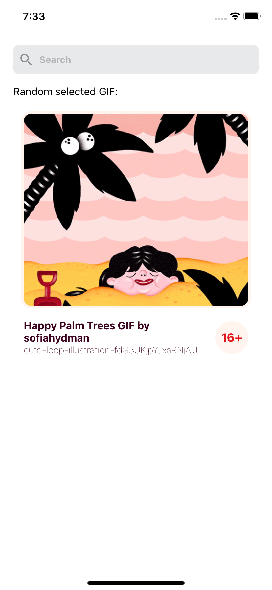
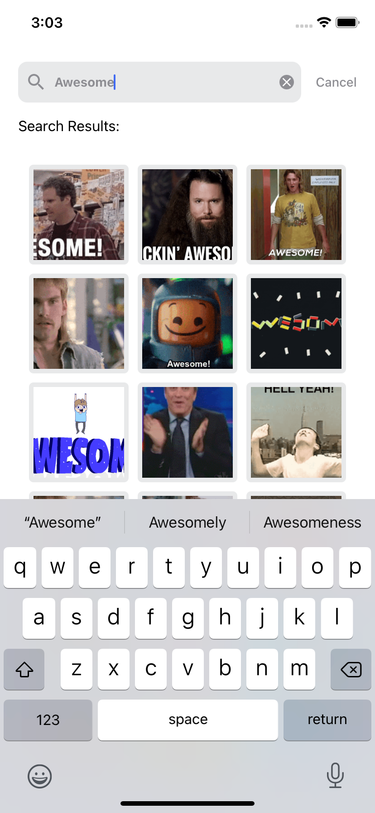

# Giphy App

## Overview

The Giphy App will show gifs randomly and based on the user's search input. so the app is built mainly using React Native and Expo with TypeScript.

## Specifications

This React Native app will cover the functionality listed below and consists of two screens:

![Wireframe][wireframe-image]

### Screen 1:

Screen 1 has the following two functionalities:

1. Displaying a random GIF:
   - Upon opening the app, it should connect to the Giphy random API and display a random GIF as displayed in **Fig 1**.
   - The random GIF displayed on this screen should be animated.
   - Every 10 seconds a new random GIF should replace the previous loaded one. This should continue as long as the user has no search results displayed.
   - **Screen 1** should also display the GIF title, link, and age restriction badge.
2. Search Bar:
   - Upon clicking the search bar, we start a live search after entering characters. This means that once the user has typed two characters, the search API should be called and not wait until the user pressed search.
   - The returning results should be displayed in **Fig 2**. The GIFs in the search results do not have to be animated and the list doesn’t have to include infinite scrolling.
   - Tapping one of the list items should navigate the user to **Screen 2**.
   - This screen should be able to retain its state, in case the user navigates back to it from **Screen 2**.
   - On canceling the search, the screen should go back to displaying the random GIF.

### Screen 2:

Screen 2 only has the following functionality:

1. Displaying the GIF that was tapped:
   - On **Screen 2** the tapped GIF should be displayed animated along with the title, link, and age restriction badge as displayed in **Fig 3**.
   - Upon tapping the back button, the user should be taken back to **Screen 1**.

### Giphy SDK docs:

- API Documentation: https://developers.giphy.com/docs/

### Concepts:

The app tackles the following points:

- Architecture and approach based on MVP pattern.
- Execution
- Testability
- Code readability and style
- Source control based on git

## Screen 1 and 2

  
  
  

## Creators

Mohamed Aimane Skhairi
skhairimedaimane@gmail.com

## License

This project is open-sourced software licensed under the MIT License

[wireframe-image]: https://imgur.com/Kja1rsy.png
